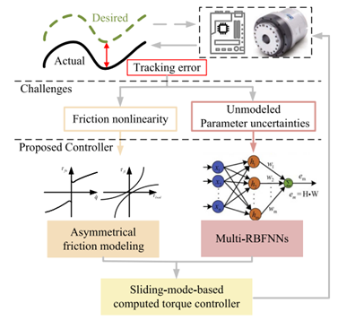

国际机器人领域顶级期刊《IEEE Robotics and Automation Letters （RAL）》2024年度最佳论文奖（Best Paper Award）

<!--more-->

近日，罗瑞卿博士在机器人关节控制领域的研究成果“Adaptive Neural Computed Torque Control for Robot Joints With Asymmetric Friction Model”获得国际机器人领域顶级期刊《IEEE Robotics and Automation Letters》（RAL）2024年度最佳论文奖（Best Paper Award）。RAL是IEEE机器人与自动化协会（IEEE Robotics and Automation Society, RAS）于2015年推出的机器人领域权威期刊（中科院2区Top期刊，JCR Q1区，影响因子4.6），该期刊每年于全球1500多篇发表文章中仅评选五篇最佳论文奖。该奖项于2025年5月19日至5月23日于美国亚特兰大举办的IEEE国际机器人于自动化大会（2025 IEEE International Conference on Robotics and Automation）正式颁发。

该研究针对机器人关节动态特性的非线性和不确定性，提出了一种创新的自适应神经网络计算力矩控制方案。该方案融合了一种新的参数化非对称摩擦模型（考虑速度、负载与温度依赖效应）与多个并行分布训练的非参数化径向基神经网络（MRBFNNs）实时补偿框架；并通过提出的非对称摩擦力模型与滑模方法协同设计，有效抑制了扰动波动边界层，实现了全局渐近收敛。实验证明，非对称模型在摩擦方面显著提高了与现实的对应性;所提出的控制策略展示了具有可变有效载荷的关节的卓越跟踪性能。

全文链接：

[DOI: 10.1109/LRA.2024.3512372](https://ieeexplore.ieee.org/document/10778318/)

Ruiqing Luo, Zhengtao Hu, Minghui Liu, Liang Du, Sheng Bao, and Jianjun Yuan, "Adaptive Neural Computed Torque Control for Robot Joints With Asymmetric Friction Model," in IEEE Robotics and Automation Letters, vol. 10, no. 1, pp. 732-739, Jan. 2025
